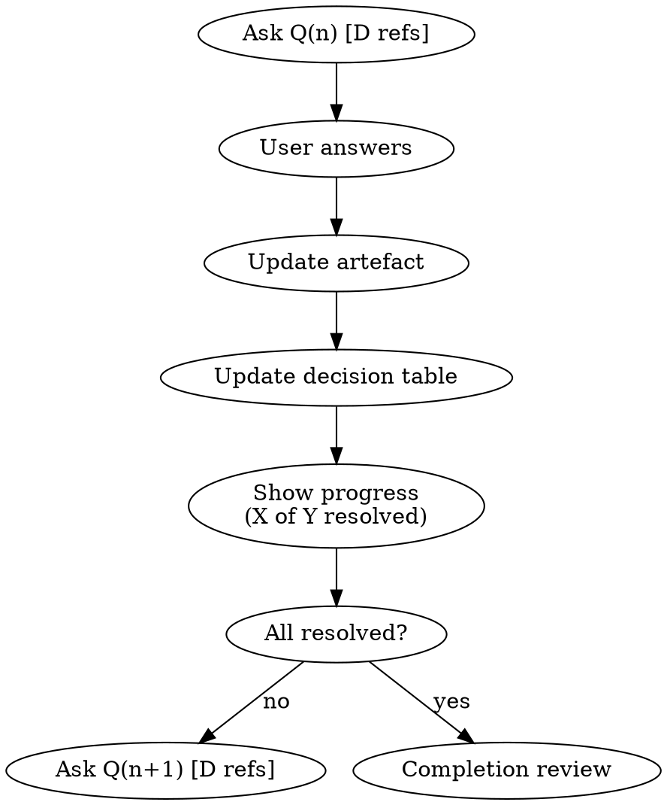

# Shaping

Shape an artefact through structured Q&A until it meets its type's bar.

## Session Start

1. **Read the type's taxonomy:** `brain_read(resource="type", name="{type-key}")` — find the `## Shaping` section for flavour, bar, and completion status
2. **Read the artefact:** `brain_read(resource="artefact", name="{path}")` — understand current state before asking anything
3. **Check for prior sessions:** If the artefact has a `**Transcripts:**` line, this is a resumption. The artefact is the source of truth for where shaping stands — read it, not the old transcripts. Only consult prior transcripts if you need to understand *why* something was decided.
4. **Start the session:** `brain_action("start-shaping", {target: "{path}"})` — creates a new transcript and links it. This is correct even for resumptions — each session gets its own transcript.
5. **Set the agenda:** Review what needs to be decided or explored. For convergent types, inventory the decision table — skip what's already resolved. For discovery types, identify unexplored territory.

## Convergent Shaping

Decision-driven. Used for Designs, Plans, Tasks, Reports, Research, Presentations, Mockups.

- Each question references decisions: `Q3 [D2, D4]`
- After each answer: update artefact, update decision list, record Q&A in transcript
- **Show progress** after every turn: "3 of 5 decisions resolved"
- **Only the user closes decisions.** Present conclusions, confirm before marking resolved.

## Discovery Shaping

Exploration-driven. Used for People, Ideas, Cookies, Journal Entries, Thoughts.

- No fixed decision list — ask questions to surface what's worth capturing
- After each answer: incorporate into artefact, record Q&A in transcript
- **Signal progress:**
  - "Still exploring — more to capture?" when the topic feels open
  - "Anything else?" when winding down

## During Shaping (Both Flavours)

**One question per turn.** Numbered Q1, Q2, ... Choose next by highest impact, not a pre-made list. Wait for the user to finish answering before moving on.

**Deferred questions.** The user can defer, reorder, or request research. Follow their lead.

**Scope expansion.** If new artefacts become involved, add them to the transcript's source line and add a `**Transcripts:**` link on the new source.

## Completing Shaping

**Don't assume done.** When questions are resolved, enter completion review — don't declare shaped.

**Review against the bar** (from the type's `## Shaping` section):
- Internal consistency — do all parts agree?
- Completeness — does it meet the bar?
- Clarity — would a new reader understand it?
- Links — provenance and transcript links in place?

Present gaps to the user:

> **Review found X potential gaps:**
> 1. [gap]
> 2. [gap]
>
> **Do any of these need more shaping?**

Only flagged gaps become new questions. Do not resume shaping without confirmation.

**When review passes:**
1. Confirm with the user before changing status — "Set status to `ready`?"
2. Set status via `brain_edit(operation="edit", path="{path}", frontmatter={"status": "ready"})` — use the completion status from the type's `## Shaping` section
3. The transcript is closed by convention (no more Q&A appended) — there is no close action
4. Signal: "Fully shaped — [artefact] is ready"

## Red Flags

- Starting to ask questions before reading the artefact
- Asking multiple questions in one turn
- Closing a decision without user confirmation
- Skipping `start-shaping` and doing transcript/linking manually
- Inventing your own completion criteria instead of reading the type's bar
- Declaring "fully shaped" without running the completion review
- Changing status without explicit user approval
